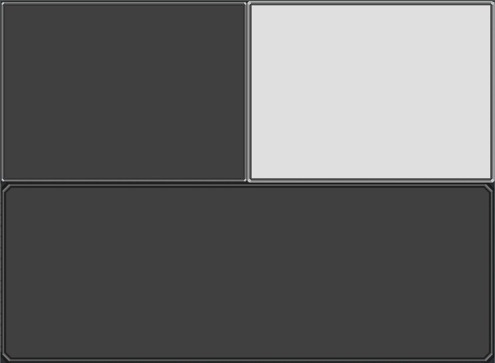

# Bevy nine slice/patch Material Plugin

Quick and easy auto-scaling nine slice/patch material for bevy ui nodes implemented as Fragment Shader.

## !Update!

In bevy 0.15 the nine slice feature introduced in 0.13 now finally runs on the GPU via shader.
This crates served its purpose and will no longer receive updates.

### Features

-   Sprite sheet animation support
-   Wasm support
-   Blend colors / tinting
-   Color lookup gradients

Making hover effects a breeze.

### Compatibility

| Nince Slice | Bevy |
| ----------- | ---- |
| 0.7         | 0.14 |
| 0.6         | 0.13 |
| 0.5         | 0.12 |

```bash
cargo add bevy_nine_slice_ui
```

## Usage

It's a single component.

The plugin as has a `sync_rate_ms` parameter, which is the minimum time between updates in milliseconds. This is to prevent the material from updating too often. The default is 100ms.

```rust
app.add_plugin(NineSliceUiPlugin::default());
```

```rust
fn spawn_ui(mut cmd: Commands, server: Res<AssetServer>) {
    commands.spawn(NineSliceUiMaterialBundle {
        style: Style {
            width: Val::Percent(100.),
            height: Val::Percent(50.),
            display: Display::Flex,
            ..default()
        },
        nine_slice_texture: NineSliceTexture::from_image(server.load("panel_atlas.png")),
        ..default()
    });
}
```

### Using an atlas instead of a single image

Also added atlas capabilities. Instead of `from_image`, use `from_slice` method and pass the texture bounds.

```rust
nine_slice_texture: NineSliceTexture::from_slice(
    server.load("panel_atlas.png"),
    Rect::new(32., 0., 32. + 48., 48.),
),
```

### Adding a material to an existing Bundle

You can also add a nine slice material to an existing bundle, like a button. Just beware, this might not always work. Just in the recent 12.1 update,
the background color component broke the material. The background color component will now be removed from elements where the material is added.

```rust
.spawn(ButtonBundle {
    style: Style {
        width: Val::Px(150.),
        height: Val::Px(50.),
        display: Display::Flex,
        justify_content: JustifyContent::Center,
        align_items: AlignItems::Center,
        ..default()
    },
    ..default()
})
.insert(NineSliceTexture::from_slice(
    server.load("panel_atlas.png"),
    Rect::new(0., 0., 32., 32.),
));

```

## Modify the texture component

You can modify the texture component to change the texture or the texture bounds. This enables simple sheet style animations.

```rust
// add a blend color
NineSliceTexture::from_image(server.load("panel_atlas.png"))
    .with_blend_color(Color::RED)
    .with_blend_mix(0.5);


// or why not a whole palatte gradient?
// A 1D texture to use as color lookup, the grayscale value of the original color is used as UV
// dark to light, left to right
NineSliceTexture::from_image(server.load("panel_atlas.png"))
    .with_lookup_gradient(server.load("4-color-palette.png"))
    .with_gradient_mix(1.0);

```

Check out the example, there is everything you need to know.

```rust
cargo run --example ui
```

result:


