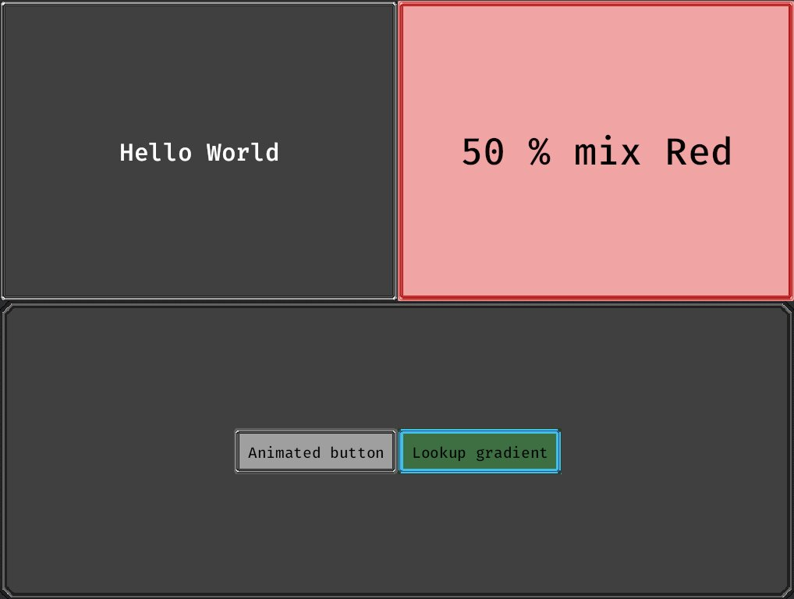

# Bevy nine slice/patch Material Plugin

Quick and easy auto-scaling nine slice/patch material for bevy ui nodes implemented as Fragment Shader.

```bash
cargo add bevy_nine_slice_ui
```

## Usage

It's a single component.

```rust
app.add_plugin(NineSliceUiPlugin::default());
```

```rust
fn spawn_ui(mut cmd: Commands, server: Res<AssetServer>) {
    commands.spawn(NodeBundle {
        style: Style {
            width: Val::Percent(100.),
            height: Val::Percent(50.),
            display: Display::Flex,
            ..default()
        },
        ..default()
    })
    .insert(NineSliceTexture::new(server.load("panel.png")));
}
```

Check out the example

```rust
cargo run --example ui
```

original


result



### Compatibility

-   **Bevy 0.12**
